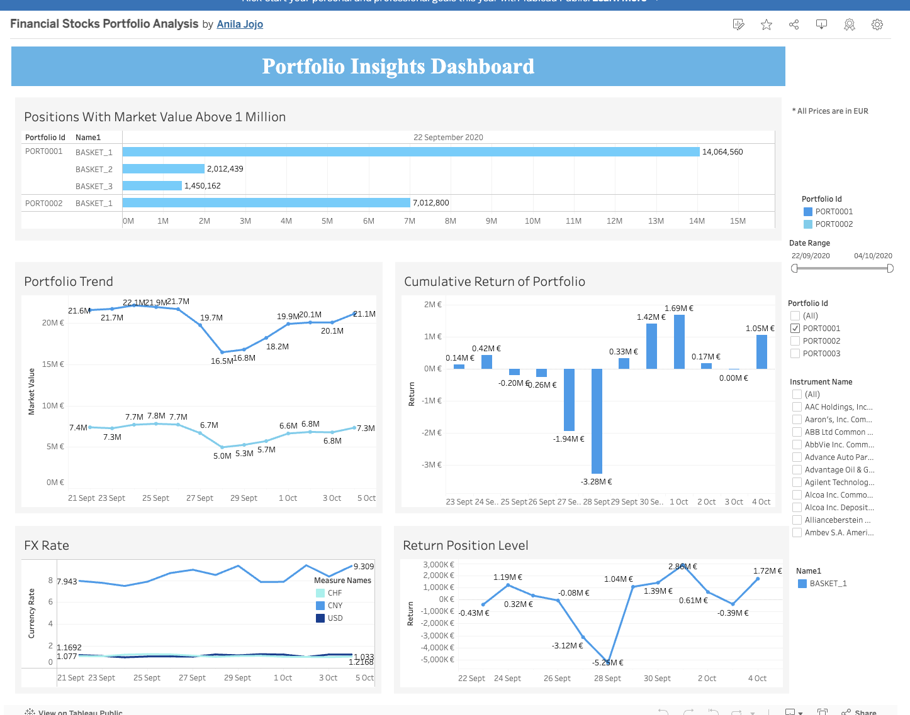

## Business Requirements
The objective of this project is to analyze the financial portfolios of instruments using the  given dataset 
and provide analysis report. The client has provided  a data set and a high-level description of the entities 
involved. The project aims to address the following questions: 
1. Find all positions with a market value above 1 million EUR. 
2. Prepare a dashboard or a report that showing the return of each portfolio in EUR. The return of a 
position  is  defined  as  the  difference  in  its  market  value  between  two  different  reporting  dates 
selected  by  the  user.  The  report  should  include  both  cumulative  returns  and  returns  at  the 
position level

## Tableau Dashboard

Dashboard Link
https://public.tableau.com/app/profile/anila.jojo/viz/tableauWorkbook/PortfolioDasboard

## Dashboard

